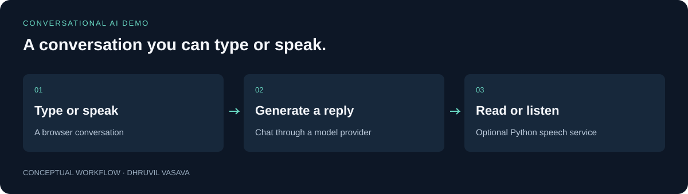

# Barney Voice Assistant

**A conversation you can type or speak.**

A character-inspired browser demo that combines text chat with optional speech input and spoken replies.

An exploration of connecting a browser experience, a language model, and a separate speech service.



[Quick start](#try-it-locally) · [Technical guide](docs/TECHNICAL_GUIDE.md) · [Checks](https://github.com/Dhruvil151/barney-voice-assistant/actions) · [Portfolio](https://github.com/Dhruvil151)

## A simple example

Open the app, send a message, and read the reply. With the optional voice setup configured, you can also hear the response and use browser speech input where supported.

## What it does

- Multi-turn chat with a bounded recent-history window.
- Optional Chatterbox or Edge speech output.
- Browser-local conversation history.
- Validation for chat and speech requests.

## Try it locally

```sh
npm ci
```

Copy `.env.example` to `.env`, configure your own Groq credentials and available model, and keep `TTS_AUTOSTART=false`.

```sh
npm start
```

Requires Node.js 22 or 24. Open `http://localhost:3000` and turn off Voice for text-only use. The technical guide covers optional Python speech setup.

## How it is built

**JavaScript · Express · Groq · Python · Chatterbox · Edge TTS**

A persistent Python service keeps the speech model loaded between requests. Text-only evaluation is available separately, so trying the chat interface does not require installing the speech stack.

See the [technical guide](docs/TECHNICAL_GUIDE.md) for setup details, architecture, and implementation boundaries.

## Checks and evidence

```sh
npm test
```

The automated suite checks the HTTP boundary without calling a live model or generating speech. A passing run is not an audio-quality evaluation.

The [publication validation report](VALIDATION.md) records earlier checks and their limits. GitHub Actions records checks for subsequent commits.

## Current scope

Unofficial fan-inspired local demo with no affiliation to the show or performers. Live voice quality and GPU compatibility depend on the environment. It has no authentication or production rate limiting.

